# Especificación integral del sistema GeoInsight Colombia

**Sistema:** GeoInsight Colombia  
**Característica:** `001-geoinsight-core`  
**Versión documental:** 1.1  
**Fecha de consolidación:** 2026-08-17  
**Estado:** implementado y validado  
**Método:** desarrollo guiado por especificaciones (Spec-Driven Development)

## 1. Propósito del documento

Este documento consolida en una sola referencia el alcance funcional, las reglas de negocio, el modelo de dominio, la arquitectura, los datos, los contratos externos, la operación y la validación de GeoInsight Colombia.

La especificación funcional original continúa siendo la fuente de verdad. En caso de contradicción prevalece, en este orden:

1. [`spec.md`](../specs/001-geoinsight-core/spec.md), para el comportamiento esperado;
2. [`data-dictionary.md`](../specs/001-geoinsight-core/data-dictionary.md), para campos, tipos y geometrías de los datasets;
3. [`contracts/api.md`](../specs/001-geoinsight-core/contracts/api.md), para la interfaz REST;
4. [`plan.md`](../specs/001-geoinsight-core/plan.md), para arquitectura e implementación;
5. los demás documentos de soporte relacionados en la sección 19.

Este consolidado no introduce requisitos nuevos ni reinterpreta los datos del Servicio Geológico Colombiano (SGC).

### 1.1 Síntesis ejecutiva y análisis propio

GeoInsight Colombia responde a un problema concreto: los datos geocientíficos abiertos son valiosos, pero sus archivos, atributos y geometrías no ofrecen por sí solos una experiencia sencilla de consulta para un usuario no especializado. La solución integra cinco dominios del SGC en una interfaz cartográfica local, conserva la procedencia de cada registro y permite describir coordenadas y zonas sin convertir los resultados en diagnósticos de riesgo.

La decisión de mayor impacto es mantener el análisis geoespacial en el backend y el dominio, mientras Leaflet se limita a interacción y representación. Esta separación evita que la regla de negocio dependa del navegador, permite probarla de forma aislada y garantiza que la simplificación usada para visualizar polígonos pesados no modifique los cálculos. El costo es una búsqueda espacial lineal y una carga inicial cercana a 122 MB; para el alcance académico, local y de un solo usuario, las mediciones actuales muestran que esta solución es suficiente y evita introducir una base de datos geoespacial que excedería el alcance.

El diseño orientado a objetos se concentra donde existe variación real: la jerarquía `Geometry` encapsula distancia, contención y límites para puntos, líneas, polígonos y variantes multiparte. En contraste, la aplicación usa composición y servicios de caso de uso para coordinar repositorios y resultados. La principal ventaja es la independencia del dominio frente a Spring, JSON y Leaflet. La principal desventaja es que una implementación geométrica propia exige más pruebas y no cubre toda la robustez topológica de una biblioteca especializada; por eso el sistema limita sus conclusiones a descripciones y explicita los casos de ausencia o geometría inválida.

El propósito de la implementación no es reemplazar el criterio de un geólogo ni determinar si un lugar es seguro. Su aporte es hacer explorables datos abiertos heterogéneos, conservar su significado original y ofrecer una base reproducible para consultas descriptivas, comparación de zonas y creación controlada de entidades propias.

## 2. Definición y objetivo

GeoInsight Colombia es una aplicación web local de información geocientífica. Integra cinco datasets abiertos del SGC con entidades creadas localmente por GeoInsight, permite su exploración cartográfica y produce análisis exclusivamente descriptivos.

El sistema permite:

- explorar cinco dominios geocientíficos en capas diferenciadas;
- buscar y filtrar usando únicamente atributos existentes en los datasets;
- consultar el contexto geocientífico de una coordenada;
- caracterizar una zona circular;
- comparar dos zonas bajo criterios equivalentes;
- crear y gestionar entidades propias de origen `GEOINSIGHT`, exclusivamente como administrador;
- operar sin conexión después de obtener por primera vez los datasets.

El sistema no calcula ni comunica riesgo, amenaza, vulnerabilidad, peligrosidad, probabilidad, seguridad o predicciones.

## 3. Alcance

### 3.1 Incluido

- Aplicación web local con backend REST y frontend cartográfico.
- Autenticación obligatoria mediante sesión HTTP.
- Registro local de usuarios de consulta.
- Cuenta administrativa sembrada desde configuración local.
- Datos SGC de solo lectura y entidades GEOINSIGHT persistentes.
- Visualización mediante Leaflet y fondo vectorial local de Colombia.
- Bootstrap de datasets antes de aceptar conexiones.
- Persistencia exclusivamente en archivos JSON/GeoJSON locales.

### 3.2 Excluido

- SSO o autenticación institucional.
- Bases de datos, JPA, Hibernate y Spring Data.
- Edición o eliminación de registros oficiales del SGC.
- Inferencias científicas no sustentadas por los datasets.
- Evaluaciones o recomendaciones de riesgo, amenaza o seguridad.
- Predicciones y servicios externos en tiempo normal de ejecución.
- Atributos, clasificaciones, restricciones o geometrías no observados en la fuente.

## 4. Actores, acceso y permisos

| Capacidad | Visitante | Usuario (`USER`) | Administrador (`ADMIN`) |
|---|---:|---:|---:|
| Ver pantalla de acceso | Sí | Sí | Sí |
| Registrarse localmente | Sí | No aplica | No aplica |
| Iniciar sesión | Sí | Sí | Sí |
| Explorar capas y entidades | No | Sí | Sí |
| Consultar coordenadas | No | Sí | Sí |
| Analizar y comparar zonas | No | Sí | Sí |
| Crear entidades GEOINSIGHT | No | No | Sí |
| Editar/eliminar entidades GEOINSIGHT | No | No | Sí |
| Editar/eliminar entidades SGC | No | No | No |

Reglas de seguridad:

- Todo acceso a la aplicación y a las API, salvo los recursos mínimos de login y registro, exige sesión.
- El registro siempre crea una cuenta `USER`; nunca puede crear un administrador.
- La cuenta `ADMIN` preexiste en `config/admin-account.json` y se siembra al iniciar.
- Las contraseñas se almacenan como hash BCrypt, nunca en texto plano.
- Las rutas `/api/admin/**` exigen rol `ADMIN`.

## 5. Historias de usuario y aceptación

### US1. Autenticación y registro — P1

Todo acceso exige autenticación. Los usuarios pueden registrarse como `USER`; el administrador accede con la cuenta sembrada.

Aceptación esencial:

- un visitante no autenticado es dirigido al acceso y las API protegidas responden `401`;
- credenciales válidas crean una sesión con el rol correcto;
- credenciales inválidas se rechazan claramente;
- un nombre de usuario duplicado produce conflicto;
- ninguna cuenta registrada obtiene rol `ADMIN`;
- un usuario normal no puede operar recursos administrativos;
- la pantalla de acceso solo ofrece login y registro local, sin SSO.

### US2. Exploración cartográfica por capas — P1

El usuario explora los cinco dominios, controla su visibilidad, inspecciona entidades y filtra mediante atributos reales.

Aceptación esencial:

- las cinco capas existen, están diferenciadas e inician apagadas;
- activar o desactivar una capa conserva el último estado solicitado;
- el detalle muestra atributos reales y procedencia;
- valores del mismo atributo se combinan con OR y atributos distintos con AND;
- cambiar de capa en el constructor limpia sus filtros anteriores;
- los resultados se listan y permiten enfocar la entidad en el mapa;
- el control “Capas” está abajo a la derecha, abre hacia arriba y cierra con clic exterior o Escape;
- el panel contextual inicia colapsado con “Buscar y filtrar” como módulo predeterminado;
- hover presenta una vista previa y clic fija el detalle completo.

### US3. Contexto de una coordenada — P1

Para una coordenada válida dentro de cobertura, el sistema informa unidades geológicas y dominios tectónicos contenedores, además de la falla, el movimiento en masa y el volcán más cercanos con sus distancias.

Aceptación esencial:

- cada dominio devuelve resultado o ausencia explícita;
- coordenadas inválidas se rechazan;
- la consulta solo se dispara desde su módulo explícito;
- el resultado distingue “Resultado”, “Contexto geológico” y “Elementos cercanos”;
- las distancias menores a 1 km se muestran en metros y las demás en kilómetros, con un decimal;
- el mapa marca el punto, contenedores y vecinos relevantes;
- una consulta desde formulario ajusta la vista sin superar el zoom máximo; un clic conserva la vista natural;
- “Borrar consulta” elimina únicamente sus resultados y resaltados;
- la cobertura se elige por disponibilidad: dominios tectónicos, unidades geológicas y, por último, borde local de Colombia;
- fuera de cobertura se responde exitosamente con `insideCoverage=false` y sin calcular vecinos.

### US4. Análisis de una zona — P2

Una zona se define por centro y radio. El sistema entrega conteos, distribuciones y entidades relevantes por dominio.

Aceptación esencial:

- centro y radio deben ser válidos; el radio es finito y mayor que cero;
- se cuentan movimientos y volcanes dentro del radio;
- se incluyen fallas, unidades y dominios que están dentro o intersectan la zona según su geometría;
- los datos ausentes se distinguen de un conteo igual a cero;
- el mapa representa centro y radio y ajusta el viewport;
- el centro puede capturarse por teclado o con selector explícito del mapa;
- los resultados no incluyen conclusiones de riesgo;
- “Borrar análisis” limpia solo los artefactos de este módulo.

### US5. Comparación descriptiva de dos zonas — P2

Dos centros se analizan con un único radio común y se presentan con esquemas equivalentes lado a lado.

Aceptación esencial:

- ambas zonas usan el mismo radio y los mismos indicadores;
- los centros y radios A/B se diferencian visualmente;
- nombres, distancias y vecinos se limitan a entidades incluidas por cada radio;
- se distinguen conteo cero, atributo ausente y dataset no disponible;
- las observaciones son descriptivas y no comparan riesgo o seguridad;
- los puntos A/B se capturan independientemente;
- “Borrar comparación” elimina sus centros, radios y resaltados.

### US6. Gestión de entidades propias — P3

El administrador crea, consulta, edita y elimina entidades `GEOINSIGHT` en cualquiera de los cinco dominios.

Aceptación esencial:

- la entidad creada conserva origen `GEOINSIGHT` y participa en consultas y análisis;
- solo `ADMIN` puede crear, editar o eliminar;
- los registros SGC siempre permanecen inmutables;
- el formulario deriva campos, tipos y valores de los datos reales;
- el backend vuelve a validar atributos, tipos y geometría;
- solo se captura Point, LineString o Polygon según el dominio;
- “Mis entidades” muestra las entidades persistidas y las diferencia por dominio;
- una eliminación exige confirmación mediante un modal propio.

## 6. Requisitos funcionales

Los identificadores conservan la numeración canónica de la spec.

### 6.1 Datos, procedencia y exploración

- **FR-001:** cargar y exponer los cinco datasets SGC.
- **FR-002:** conservar la procedencia `SGC` o `GEOINSIGHT` de cada entidad.
- **FR-003:** mantener los registros SGC como solo lectura.
- **FR-006:** presentar cinco capas diferenciadas y conmutables.
- **FR-007:** permitir selección y consulta de atributos reales.
- **FR-008:** buscar y filtrar solo mediante atributos existentes.
- **FR-014:** indicar explícitamente la ausencia de resultados.
- **FR-015:** hacer visible la procedencia en las consultas.
- **FR-020:** distinguir inequívocamente un dataset ausente o sin datos.
- **FR-026:** iniciar las capas apagadas y respetar su último estado.
- **FR-027:** aplicar OR dentro de un atributo, AND entre atributos y limpiar filtros al cambiar de capa.
- **FR-028:** listar resultados y permitir enfocar su geometría.
- **FR-039:** adaptar etiquetas y valores al ancho disponible.
- **FR-040:** ubicar el control compacto “Capas” abajo a la derecha, con icono, tooltip y accesibilidad.
- **FR-041:** abrir el selector hacia arriba y cerrarlo por clic exterior o Escape; no duplicar la herramienta en el lateral.
- **FR-042:** iniciar el panel contextual colapsado y con “Buscar y filtrar” seleccionado.
- **FR-047:** mostrar vista previa en hover y detalle completo en clic.

### 6.2 Análisis geoespacial

- **FR-009:** consultar el contexto geocientífico de una coordenada.
- **FR-010:** analizar una zona definida por centro y radio.
- **FR-011:** comparar dos zonas bajo los mismos criterios.
- **FR-012:** no calcular ni comunicar riesgo, amenaza, vulnerabilidad, peligrosidad, probabilidad, seguridad o predicciones.
- **FR-013:** derivar de los datos la semántica de contención, intersección, cercanía y distancia.
- **FR-016:** validar coordenadas y radios antes de procesar.
- **FR-017:** respetar tipo geométrico, CRS y orden de coordenadas.
- **FR-029:** ligar la selección en mapa al formulario que la solicita.
- **FR-030:** representar centros y radios, reemplazar la vista previa y ajustar el viewport.
- **FR-031:** reutilizar el análisis de zona al comparar y limitar vecinos a cada radio, distinguiendo estados de ausencia.
- **FR-038:** iniciar vacías las coordenadas de zona/comparación y permitir teclado o selección en mapa.
- **FR-043:** separar el contexto puntual en tres secciones y tarjetas por dominio.
- **FR-044:** formatear distancias en m o km con un decimal y formato español.
- **FR-045:** marcar el punto consultado, contenedores y vecinos; ajustar la vista solo cuando corresponda.
- **FR-046:** priorizar nombres descriptivos, relegar identificadores técnicos y presentar ausencias legibles.
- **FR-048:** proporcionar una acción “Borrar” aislada para cada análisis, sin desactivar capas temáticas.
- **FR-049:** aplicar la cascada de cobertura solo a consulta puntual; fuera de cobertura no calcular vecinos.

### 6.3 Administración y entidades GEOINSIGHT

- **FR-004:** permitir crear entidades solo al administrador.
- **FR-005:** permitir editar o eliminar solo entidades GEOINSIGHT y solo al administrador.
- **FR-018:** derivar campos y dominios de valores de atributos reales; exigir un identificador descriptivo por dominio.
- **FR-019:** incluir entidades GEOINSIGHT en consultas y análisis sin presentarlas como SGC.
- **FR-032:** aceptar únicamente atributos descriptivos autorizados y tipos observados; excluir metadatos técnicos y campos sin tipo.
- **FR-033:** dibujar y validar la geometría principal admitida por cada dominio.
- **FR-034:** mantener visibles las entidades propias, diferenciarlas por dominio y confirmar su eliminación.

### 6.4 Autenticación, autorización y navegación

- **FR-021:** exigir autenticación previa para todo acceso protegido.
- **FR-022:** registrar cuentas de consulta únicamente con rol `USER`.
- **FR-023:** sembrar el administrador desde JSON local e impedir su creación por registro.
- **FR-024:** persistir cuentas y almacenar contraseñas mediante hash seguro.
- **FR-025:** identificar el rol en sesión y restringir las operaciones administrativas.
- **FR-035:** explicar cada módulo en la ayuda y mostrar contenido administrativo solo a `ADMIN`.
- **FR-036:** ofrecer únicamente login y registro local, con recursos visuales públicos mínimos y sin SSO.
- **FR-037:** mostrar solo controles funcionales y una única identidad de sesión, sin búsqueda global inexistente.

### 6.5 Disponibilidad al arrancar

- **FR-050:** no aceptar solicitudes antes de verificar, recuperar y cargar los datasets, o declarar su ausencia después de agotar la recuperación.
- **FR-051:** reintentar un número finito y configurable cada descarga; tras agotarlo, continuar el arranque con `dataAvailable=false`.

## 7. Reglas geoespaciales

- CRS de los datos de salida: EPSG:4326.
- Orden de coordenadas: longitud, latitud.
- Longitud válida: `[-180, 180]`; latitud válida: `[-90, 90]`.
- Distancia entre coordenadas: fórmula haversine.
- Distancia punto-geometría: mínima distancia a puntos o segmentos según el tipo.
- Contención en polígonos: ray casting; las geometrías multiparte evalúan todas sus partes.
- Un empate de proximidad se resuelve de forma determinista por identificador lexicográfico.
- Una entidad pertenece al análisis de zona cuando su distancia mínima al centro es menor o igual al radio; esto cubre la intersección parcial de líneas y polígonos.
- Los polígonos completos se usan para análisis; la simplificación se limita a visualización.
- `MultiPoint`, `MultiLineString` y `MultiPolygon` se soportan como geometrías de fuentes SGC.
- Las geometrías nulas, vacías o inválidas no generan datos inventados y el dominio afectado conserva un estado explícito de ausencia.

## 8. Dominios y diccionario resumido de datos

Los datos fueron perfilados sobre los archivos completos, no sobre muestras.

### 8.1 Formato, volumen y actualización

Los cinco conjuntos se obtienen desde servicios ArcGIS FeatureServer del SGC y se descargan como **GeoJSON** en coordenadas EPSG:4326, con orden longitud-latitud. El backend también persiste cuentas y entidades propias como **JSON** local. GeoJSON es una extensión de JSON: agrega estructuras normalizadas para geometrías y colecciones de elementos geográficos, mientras que los archivos de cuentas y entidades propias usan objetos JSON del modelo interno.

El volumen conjunto observado es de aproximadamente 121,7 MB decimales: unidades geológicas 107,8 MB, fallas 7,4 MB, dominios tectónicos 4,1 MB, movimientos en masa 2,3 MB y volcanes menos de 0,1 MB. La aplicación no modifica los archivos oficiales. En cada arranque verifica existencia, legibilidad y conteo esperado; solo intenta descargar de nuevo un archivo cuando falta, está corrupto o su número de registros no coincide.

La fuente no publica dentro de estos archivos una periodicidad uniforme de actualización que la aplicación pueda garantizar. Por ello, GeoInsight no presenta una fecha inventada de vigencia: conserva los datos descargados y permite su recuperación desde los endpoints configurados. Los *tags* funcionales usados para organizar el contenido son los cinco dominios del sistema: movimientos en masa, fallas geológicas, unidades geológicas, dominios tectónicos y volcanes. Los filtros visibles se derivan de atributos reales de cada dominio, no de etiquetas creadas por la aplicación.

Como control de integridad entre formatos, una exportación alternativa —por ejemplo CSV para atributos tabulares— debe compararse mediante conteo de registros, identificadores y valores de atributos. CSV no representa geometrías complejas de forma equivalente sin una convención adicional, por lo que el GeoJSON permanece como fuente operativa. Esta comparación es una verificación recomendada del entregable y no se declara completada mientras no exista un archivo alternativo y un reporte reproducible.

| Dominio | Archivo | Registros | Geometría principal | Campo requerido GEOINSIGHT | Campos filtrables |
|---|---|---:|---|---|---|
| Movimiento en masa | `Inventario_de_movimientos_en_masa.geojson` | 6.826 | Point | `TIPO` | `TIPO`, `SUBTIPO`, `CLAS_MAPA` |
| Falla geológica | `Fallas.geojson` | 4.866 | LineString | `NombreFalla` | `NombreFalla`, `Tipo` |
| Unidad geológica | `Mapa_Geologico_de_Colombia_2015.geojson` | 7.461 | Polygon | `SimboloUC` | `SimboloUC`, `Edad` |
| Dominio tectónico | `Mapa_Tectonico_de_Colombia_2017.geojson` | 3 | Polygon | `NombreDT` | `NombreDT` |
| Volcán | `Volcanes.geojson` | 61 | Point | `NombreVolcan` | `NombreVolcan` |

Campos descriptivos editables observados:

| Dominio | Campos editables |
|---|---|
| Movimiento en masa | `ID`, `INV_MOVIMI`, `TIPO`, `SUBTIPO`, `CLAS_MAPA`, `ETIQUETA_M` |
| Falla geológica | `Tipo`, `NombreFalla` |
| Unidad geológica | `SimboloUC`, `Descripcion`, `Edad`, `UGIntegradas`, `Comentarios` |
| Dominio tectónico | `CodigoDT`, `NombreDT`, `Label` |
| Volcán | `NombreVolcan`, `AlturaSobreNivelMar`, `Comentarios`, `URL` |

Los identificadores del proveedor, medidas derivadas y campos sin tipo observable se conservan al consultar si existen en la fuente, pero no se capturan manualmente. Los nulos y blancos históricos se preservan sin normalización. Las reglas de obligatoriedad solo aplican a nuevas entidades GEOINSIGHT.

## 9. Modelo de dominio

### 9.1 Entidades y valores

- `GeoscienceEntity`: identificador, `Domain`, `Origin`, `Geometry` y atributos dinámicos `Map<String,Object>`. Dominio y procedencia son inmutables.
- `Domain`: `MOVIMIENTO_EN_MASA`, `FALLA_GEOLOGICA`, `UNIDAD_GEOLOGICA`, `DOMINIO_TECTONICO`, `VOLCAN`.
- `Origin`: `SGC`, `GEOINSIGHT`.
- `Coordinate`: valor inmutable con longitud y latitud validadas.
- `Zone`: valor inmutable compuesto por centro y radio en metros, finito y mayor que cero.
- `UserAccount`: nombre de usuario, hash BCrypt y `Role`.
- `Role`: `USER`, `ADMIN`.

### 9.2 Jerarquía geométrica

`Geometry` define el comportamiento común `distanceTo`, `contains` y `bounds`. Sus especializaciones legítimas son `Point`, `LineString`, `Polygon`, `MultiPoint`, `MultiLineString` y `MultiPolygon`. La construcción se centraliza en `GeometryFactory` para evitar estados inválidos.

### 9.3 Resultados de análisis

- Contexto de coordenada: cobertura, contenedores y vecinos por dominio.
- Desglose de zona: `dataAvailable`, conteo, distribuciones y entidades.
- Comparación: dos análisis equivalentes y vecinos restringidos al radio de cada lado.
- Los registros sin atributo de clasificación se agrupan como `Sin clasificar`.
- `dataAvailable=false` no equivale a un conteo igual a cero.

## 10. Arquitectura

La solución es un único artefacto Maven organizado por capas:

```text
Frontend HTML/CSS/JS + Leaflet
            |
            v
Web: controladores REST, DTO y seguridad
            |
            v
Aplicación: casos de uso y coordinación
            |
            v
Dominio: reglas, entidades y geometrías
            ^
            |
Infraestructura: JSON/GeoJSON, descarga y bootstrap
```

Responsabilidades:

- **Dominio:** invariantes, geometría y abstracciones de repositorio; no depende de Spring, Jackson, HTTP, JSON o frontend.
- **Aplicación:** autenticación, exploración, contexto, análisis, comparación y administración.
- **Infraestructura:** lectura/escritura JSON, parseo GeoJSON, descarga SGC, basemap y bootstrap.
- **Web:** presentación HTTP, validación de DTO, sesión, roles y traducción de errores.
- **Frontend:** interacción, representación cartográfica y presentación; no contiene lógica de negocio geoespacial.

### 10.1 Diagrama de contexto

Este diagrama delimita el sistema y sus dependencias externas. El SGC interviene en la descarga o recuperación de datasets, pero no es necesario durante la operación normal con datos locales válidos.

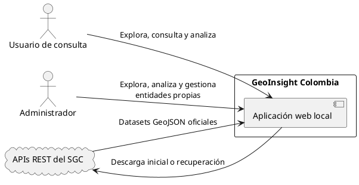

### 10.2 Diagrama de contenedores y componentes

Las dependencias apuntan hacia el dominio. Infraestructura implementa los puertos definidos por este; el frontend consume únicamente la interfaz HTTP.

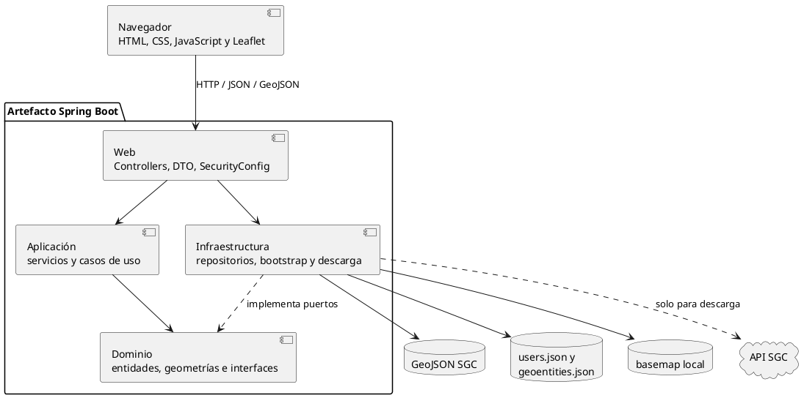

### 10.3 Diagrama de clases del núcleo

La especialización polimórfica se concentra en geometrías. Los cinco dominios no se representan con subclases artificiales porque comparten comportamiento y difieren en datos, geometría y metadatos.

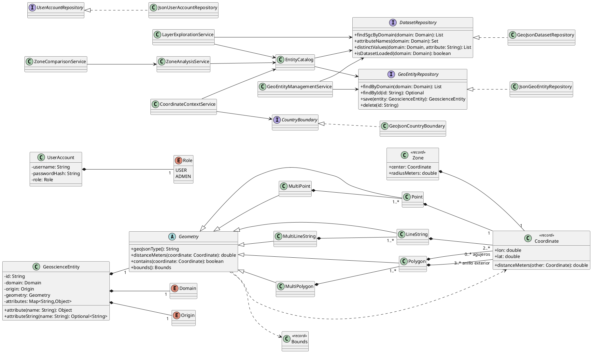

### 10.4 Diagrama de despliegue

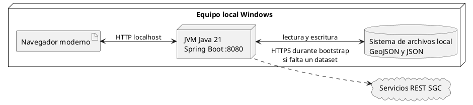

### 10.5 Diagrama de estados de acceso

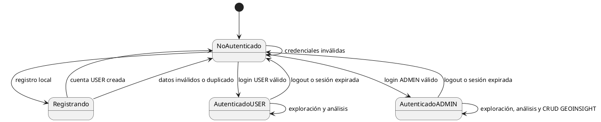

### 10.6 Secuencia de arranque y disponibilidad

Esta secuencia cubre FR-050 y FR-051: el servidor no abre el puerto antes de finalizar la verificación y recuperación finita.

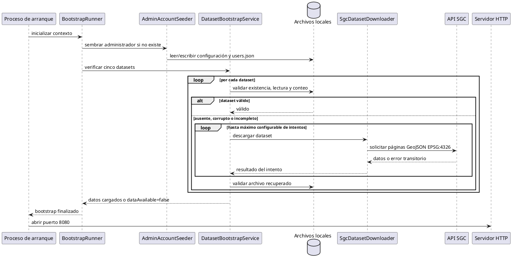

### 10.7 Secuencia de autenticación

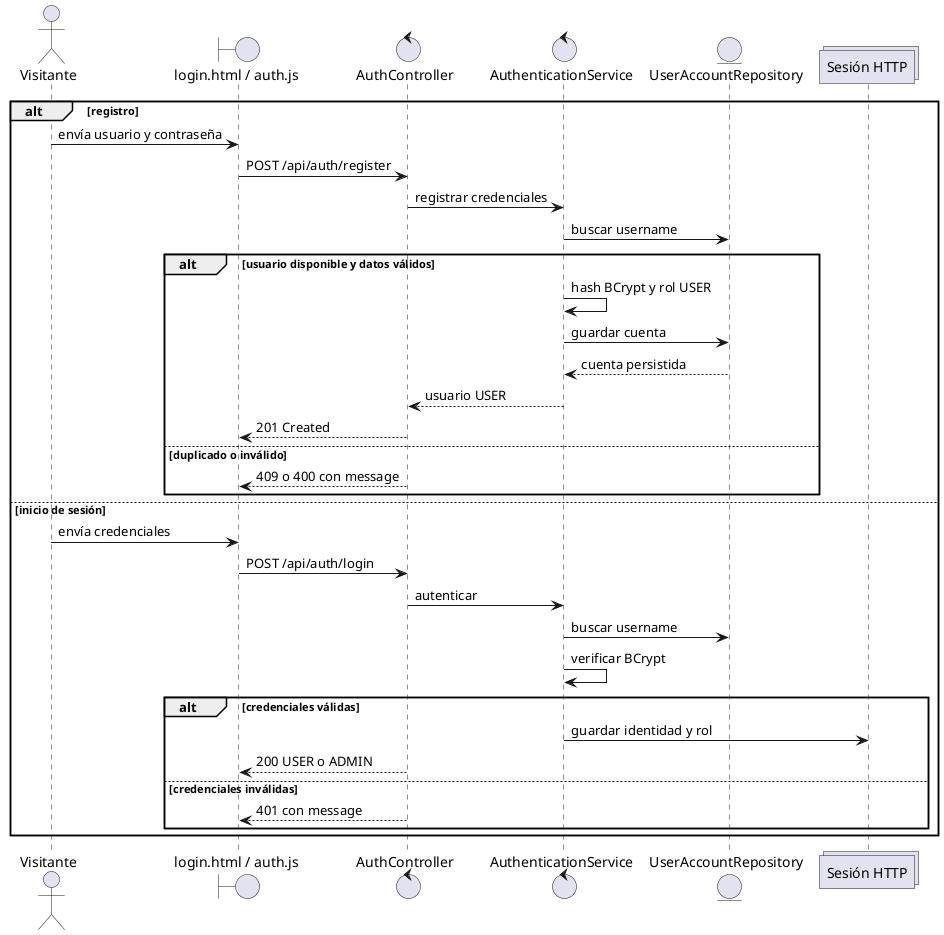

### 10.8 Secuencia de exploración y filtrado

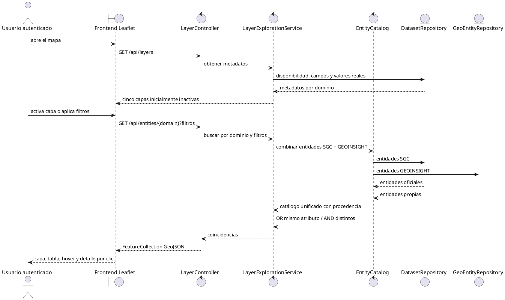

### 10.9 Secuencia de consulta por coordenada

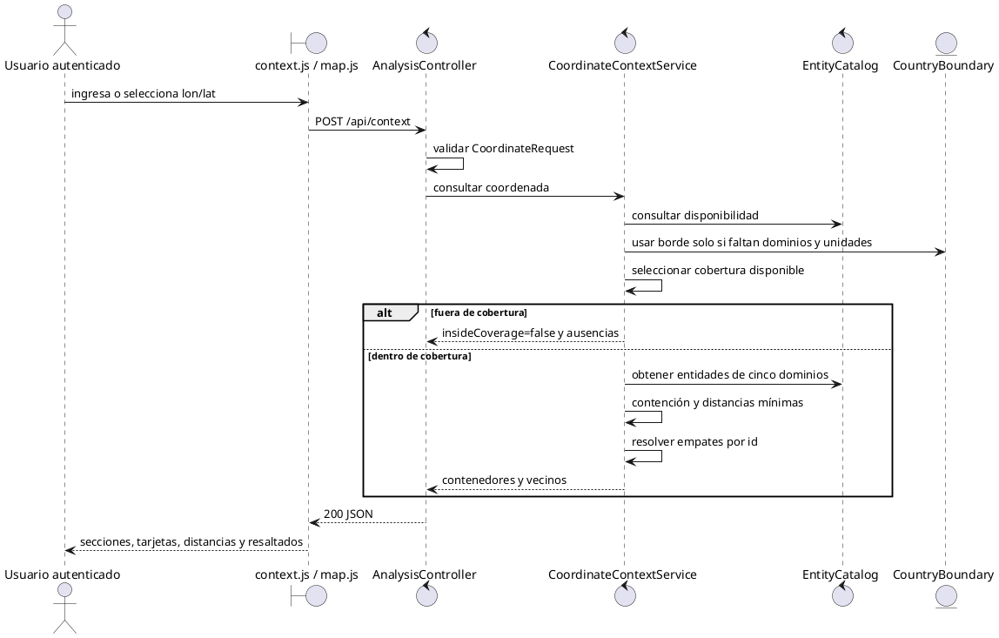

### 10.10 Secuencia de análisis y comparación de zonas

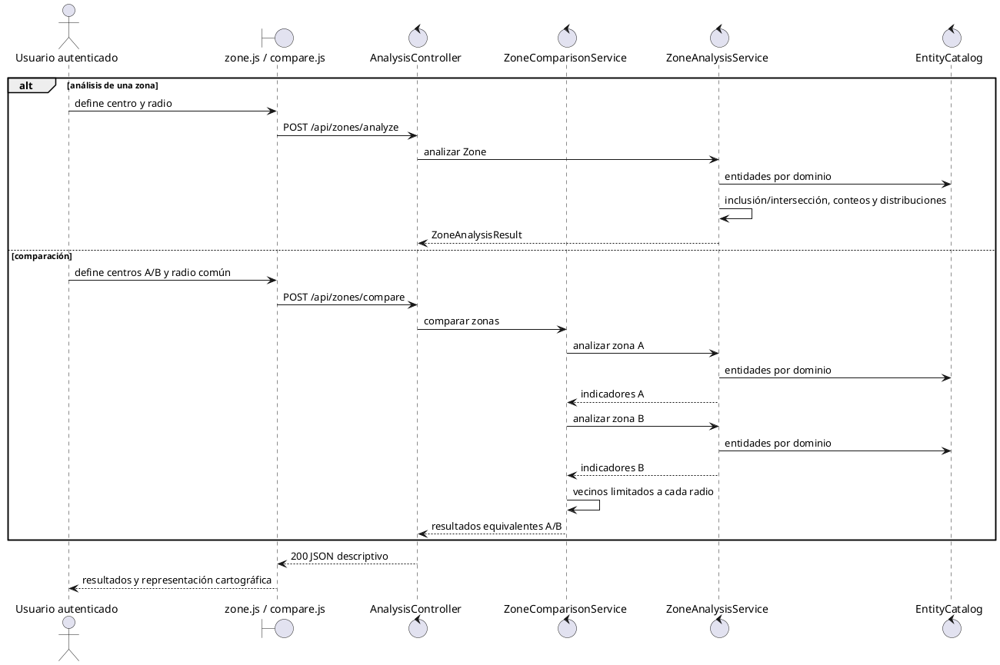

### 10.11 Secuencia de gestión administrativa

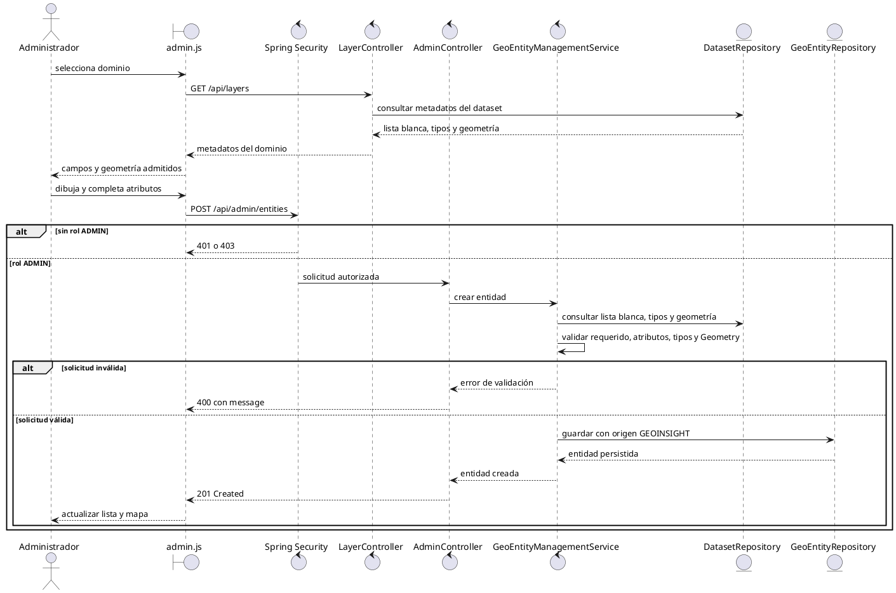

## 11. Tecnología y restricciones técnicas

- Java 21 LTS.
- Apache Maven 3.9.x con Maven Wrapper.
- Spring Boot 3.3.x: Web, Security y Validation.
- Jackson para JSON/GeoJSON.
- Spring Security y BCrypt.
- Leaflet 1.9.x distribuido localmente, sin CDN.
- JUnit 5 y AssertJ para pruebas; Mockito solo cuando el aislamiento lo justifica.
- Plataforma objetivo: Windows, navegador moderno, `http://localhost:8080`.
- Un usuario activo y aproximadamente 19.000 entidades SGC.
- No se introducen bases de datos ni frameworks frontend adicionales.

## 12. Persistencia y bootstrap

| Ruta | Contenido | Acceso |
|---|---|---|
| `docs/datasets/*.geojson` | datasets SGC | solo lectura, no versionados |
| `data/geoentities.json` | entidades GEOINSIGHT | lectura/escritura administrativa |
| `data/users.json` | cuentas | lectura/escritura |
| `config/admin-account.json` | configuración del admin sembrado | lectura, versionado |
| `src/main/resources/basemap/colombia.geojson` | fondo vectorial local | lectura, versionado |

Secuencia de arranque:

1. sembrar la cuenta administrativa si no existe;
2. verificar existencia, legibilidad y conteo oficial de cada dataset;
3. descargar los archivos ausentes, corruptos o incompletos;
4. reintentar hasta el máximo configurado, con espera incremental;
5. cargar los datos válidos en memoria;
6. marcar con `dataAvailable=false` lo no recuperado;
7. abrir el puerto HTTP únicamente al terminar el proceso.

La red solo es necesaria para la obtención inicial o recuperación de datasets. Una vez disponibles, aplicación, datos, Leaflet y basemap funcionan localmente.

## 13. Rutas del sistema y contrato REST

La aplicación expone dos superficies diferentes. Las **rutas del frontend** entregan páginas o archivos estáticos al navegador; los **endpoints del backend** ejecutan operaciones y responden con JSON o GeoJSON bajo el prefijo `/api`. Esta separación evita tratar una pantalla HTML como si fuera una operación de la API.

### 13.1 Rutas del frontend

| Método y ruta | Propósito | Acceso |
|---|---|---|
| `GET /login.html` | mostrar login y registro | público |
| `GET /` | abrir la aplicación principal | autenticado |
| `GET /index.html` | mostrar la interfaz cartográfica | autenticado |
| `GET /css/login*.css` | estilos de la pantalla de acceso | público |
| `GET /js/api.js` | cliente HTTP necesario para autenticación | público |
| `GET /js/auth.js` | interacción de login y registro | público |
| imágenes públicas declaradas en `SecurityConfig` | identidad visual del acceso | público |
| demás recursos `/css/**`, `/js/**`, `/images/**`, `/assets/**` y `/lib/**` | interfaz completa y Leaflet local | autenticado |

Una solicitud HTML protegida sin sesión se redirige a `/login.html`.

### 13.2 Endpoints REST del backend

Formato general: JSON; las capas y geometrías se entregan como GeoJSON cuando corresponde. Los errores usan `{ "message": "..." }`; códigos comunes: `400`, `401`, `403`, `404` y `409`.

#### Autenticación

| Método y endpoint | Propósito | Acceso |
|---|---|---|
| `POST /api/auth/register` | registrar cuenta `USER` | público |
| `POST /api/auth/login` | crear sesión | público |
| `POST /api/auth/logout` | cerrar sesión | público; invalida la sesión si existe |
| `GET /api/auth/me` | consultar identidad y rol | autenticado |

#### Exploración y datos

| Método y endpoint | Propósito | Acceso |
|---|---|---|
| `GET /api/layers` | metadatos, conteos, disponibilidad y atributos | autenticado |
| `GET /api/layers/{domain}/geojson` | obtener capa GeoJSON | autenticado |
| `GET /api/entities/{domain}` | filtrar entidades | autenticado |
| `GET /api/entities/{domain}/{id}` | consultar detalle | autenticado |
| `GET /api/basemap/colombia` | obtener fondo vectorial local | autenticado |

#### Análisis geoespacial

| Método y endpoint | Propósito | Acceso |
|---|---|---|
| `POST /api/context` | consultar una coordenada | autenticado |
| `POST /api/zones/analyze` | analizar una zona | autenticado |
| `POST /api/zones/compare` | comparar dos zonas | autenticado |

#### Administración

| Método y endpoint | Propósito | Acceso |
|---|---|---|
| `GET /api/admin/entities` | listar entidades propias | `ADMIN` |
| `POST /api/admin/entities` | crear entidad propia | `ADMIN` |
| `PUT /api/admin/entities/{id}` | actualizar entidad propia | `ADMIN` |
| `DELETE /api/admin/entities/{id}` | eliminar entidad propia | `ADMIN` |

El contrato de cuerpos, respuestas y errores está definido íntegramente en [`contracts/api.md`](../specs/001-geoinsight-core/contracts/api.md).

## 14. Interfaz e interacción

- `login.html` contiene identidad visual, login y registro local.
- `index.html` contiene navegación por módulos, mapa, panel contextual y administración condicionada por rol.
- Las capas temáticas empiezan inactivas.
- El selector flotante de capas es el único punto de activación de capas.
- Los selectores de coordenada se activan explícitamente para impedir cruces entre módulos.
- Contexto, zona y comparación mantienen resultados y acciones de limpieza independientes.
- Las entidades se diferencian por dominio y procedencia.
- Los puntos masivos se representan en Canvas para reducir nodos SVG.
- Los polígonos pesados usan simplificación Douglas-Peucker únicamente para render.
- Leaflet y sus recursos son locales para admitir operación sin conexión.

## 15. Criterios de éxito

| ID | Criterio |
|---|---|
| SC-001 | Mostrar los cinco dominios y permitir activar cualquier capa en menos de 10 s en una máquina local. |
| SC-002 | Responder una consulta por coordenada en menos de 5 s. |
| SC-003 | Responder un análisis de zona en menos de 5 s. |
| SC-004 | Mostrar indicadores equivalentes lado a lado al comparar. |
| SC-005 | No producir conclusiones de riesgo, amenaza o seguridad. |
| SC-006 | Mantener sin cambios el 100 % de registros SGC. |
| SC-007 | Usar atributos reales en el 100 % de filtros y búsquedas. |
| SC-008 | Exigir autenticación en todos los accesos y nunca registrar un admin. |
| SC-009 | Rechazar atributos administrativos no permitidos y tipos incompatibles. |
| SC-010 | Capturar coordenadas/geometrías desde mapa sin activar herramientas ajenas. |
| SC-011 | Garantizar que la primera respuesta aceptada refleje el bootstrap ya concluido. |

## 16. Casos límite

- Geometrías multiparte y polígonos con agujeros.
- Geometrías nulas, vacías, corruptas o inválidas.
- Coordenadas fuera de cobertura.
- Polígonos superpuestos y empates de proximidad.
- Atributos nulos, ausentes o con cadenas en blanco.
- Entidades que intersectan parcialmente el límite de una zona.
- Datasets ausentes, vacíos, ilegibles o incompletos.
- Descargas con fallos transitorios o agotamiento de reintentos.
- Registro de usuario duplicado.
- Intentos de acceso administrativo por `USER`.
- Intentos de modificar entidades SGC.
- Respuestas asíncronas obsoletas al alternar capas en el frontend.

## 17. Pruebas y evidencia de validación

La estrategia prioriza:

1. pruebas unitarias de dominio;
2. pruebas de servicios/casos de uso;
3. pruebas de infraestructura y contratos web;
4. validación visual y manual de extremo a extremo.

Comando de aceptación:

```powershell
.\mvnw.cmd clean verify
```

Evidencia automatizada actualizada el 2026-08-17:

- 101 pruebas ejecutadas, 0 fallos, 0 errores y 0 omitidas;
- GeoJSON simplificado de 7.461 unidades: 0,753 s, presupuesto menor a 10 s;
- contexto de coordenada: 0,149 s, presupuesto menor a 5 s;
- análisis de zona de 50 km: 0,648 s, presupuesto menor a 5 s;
- bootstrap probado ante un primer HTTP 503 y recuperación en el segundo intento;
- primera respuesta con conteos `6826/4866/7461/3/61` y todos los dominios disponibles;
- escenarios manuales E1–E9 completados;
- operación sin conexión comprobada con datos previamente descargados.

Los tiempos automatizados de servidor no sustituyen la validación de render del navegador requerida por SC-001.

## 18. Instalación y ejecución

Prerrequisitos: Java 21. El Maven Wrapper está incluido.

```powershell
.\mvnw.cmd clean verify
.\mvnw.cmd spring-boot:run
```

La aplicación queda disponible en `http://localhost:8080` después de completar el bootstrap. La descarga manual opcional se ejecuta con:

```powershell
powershell -ExecutionPolicy Bypass -File scripts\download-datasets.ps1
```

Los reintentos se configuran mediante `geoinsight.download.max-attempts` y `geoinsight.download.retry-delay-ms` en `application.properties`.

## 19. Trazabilidad documental

| Documento | Responsabilidad |
|---|---|
| [`spec.md`](../specs/001-geoinsight-core/spec.md) | historias, aceptación, FR y SC canónicos |
| [`plan.md`](../specs/001-geoinsight-core/plan.md) | contexto técnico, arquitectura y estructura |
| [`research.md`](../specs/001-geoinsight-core/research.md) | evidencia de datasets y decisiones técnicas |
| [`data-dictionary.md`](../specs/001-geoinsight-core/data-dictionary.md) | campos, tipos, nulabilidad y geometrías reales |
| [`data-model.md`](../specs/001-geoinsight-core/data-model.md) | entidades, valores, resultados y persistencia |
| [`design.md`](../specs/001-geoinsight-core/design.md) | diseño orientado a objetos y diagramas |
| [`contracts/api.md`](../specs/001-geoinsight-core/contracts/api.md) | contrato REST detallado |
| [`tasks.md`](../specs/001-geoinsight-core/tasks.md) | tareas de implementación por historia |
| [`traceability.md`](../specs/001-geoinsight-core/traceability.md) | relación datos → requisitos → código → pruebas |
| [`quickstart.md`](../specs/001-geoinsight-core/quickstart.md) | escenarios operativos de aceptación |
| [`validation.md`](../specs/001-geoinsight-core/validation.md) | resultados automatizados y manuales |
| [`GEOINSIGHT_SYSTEM_CONTEXT.md`](./GEOINSIGHT_SYSTEM_CONTEXT.md) | contexto funcional que dio origen al SDD |

## 20. Control de cambios

Cualquier modificación funcional debe comenzar en la especificación canónica y actualizar, según corresponda, plan, modelo, contrato, tareas, pruebas, trazabilidad y este consolidado. No se deben deducir nuevos requisitos a partir de la implementación existente ni normalizar datos del SGC sin soporte explícito de la especificación.
