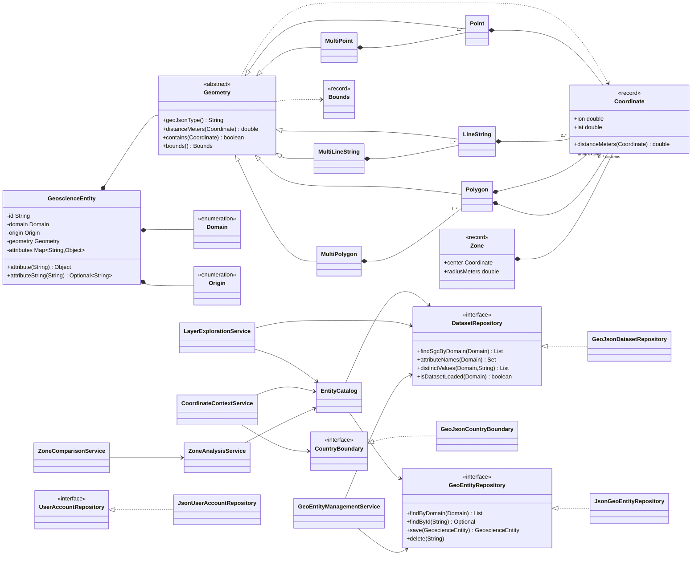
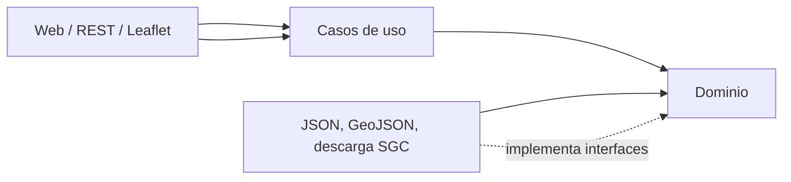

# Diseño orientado a objetos

**Feature**: `001-geoinsight-core` | **Fuente**: [spec.md](./spec.md) | **Modelo detallado**: [data-model.md](./data-model.md)

Este documento hace explícito el diseño conceptual que guía la implementación. Las flechas de dependencia apuntan hacia el dominio: el dominio no conoce Spring, Jackson, HTTP, JSON ni Leaflet.

## Diagrama de clases del núcleo

## Decisiones POO demostradas

| Principio | Evidencia de diseño |
|---|---|
| Abstracción | `Geometry` define el contrato geoespacial común y oculta el algoritmo concreto de cada tipo. |
| Herencia | Los seis tipos GeoJSON admitidos especializan `Geometry`. |
| Polimorfismo | Los casos de uso invocan `distanceMeters`, `contains` y `bounds` mediante `Geometry`, sin condicionar por cada dominio. |
| Encapsulamiento | Entidades y geometrías protegen estado privado, validan al construirse y exponen colecciones inmutables; no requieren setters. |
| Composición | Una entidad se compone de dominio, origen, geometría y atributos; las variantes multiparte se componen de geometrías simples. |
| Inversión de dependencias | Los casos de uso dependen de interfaces del dominio; JSON y GeoJSON son adaptadores de infraestructura. |

No existen cinco subclases de `GeoscienceEntity` porque los datasets muestran el mismo comportamiento y difieren en geometría y atributos. Crear esas subclases produciría una jerarquía artificial; la especialización polimórfica legítima está en las geometrías.

## Fronteras arquitectónicas

